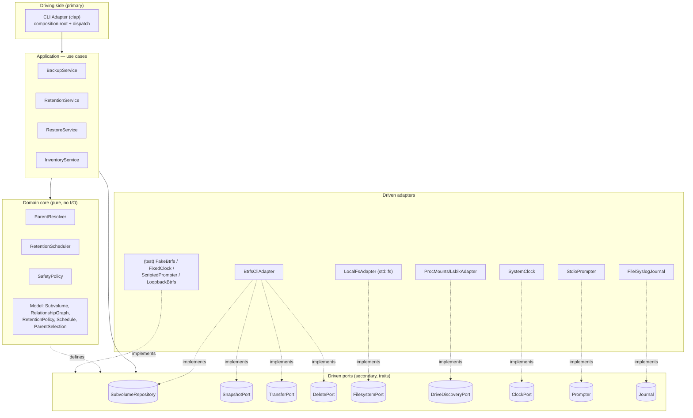
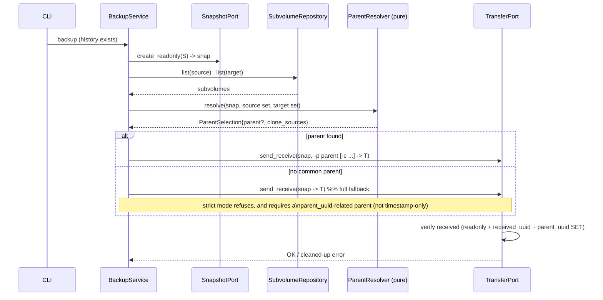
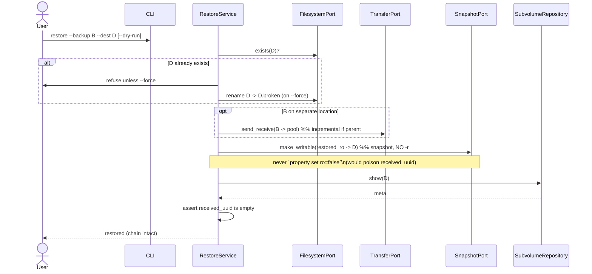

# mybtrfs — Architecture (v2, development)

> **Development reference.** High-level module architecture using **SOLID** and
> **hexagonal (ports & adapters)** architecture, with sequence diagrams and a
> fail-safe verification pass. This v2 folds in the documentation-review
> corrections (parent_uuid verification, the precise delete-safety anchors,
> diagram fixes, the `FilesystemPort`, divergence notes) and supersedes
> `02-architecture.md`. Companion: `01-phases-design-v2.md`. Diagrams are Mermaid.

---

## 1. Guiding principles

The value and the risk of mybtrfs live in its **decisions**: which subvolume is
the right incremental parent, which snapshots to delete, how to restore without
breaking the chain. Those decisions must be **pure, deterministic (given an
injected clock and timezone), and testable without a real filesystem**. Everything that touches the outside world — the
`btrfs` CLI, the OS mount table, the wall clock, the terminal — is a replaceable
detail.

Hexagonal architecture enforces this split:

- A **domain core** with no I/O and no knowledge of `btrfs` or the OS.
- **Ports** (interfaces) describing what the core needs from / offers to the
  outside.
- **Adapters** implementing those ports against real (or fake) infrastructure.
- **The dependency rule:** all source-code dependencies point **inward**. The
  domain never imports an adapter.

---

## 2. The hexagon



Dependencies point inward: adapters depend on ports, the application depends on
ports + core, the core depends on nothing external. Concrete adapters are
selected and wired only at the **composition root** (the CLI `main`).

---

## 3. Layers in detail

### Domain core (pure, no I/O)
- **Model** — `Subvolume` (id, three UUIDs, gen/cgen, readonly, path, **owning
  filesystem UUID, mountpoint**), `RelationshipGraph` (the three UUID indexes,
  built **per filesystem**), `RetentionPolicy`, `Schedule{preserve, delete}`,
  `ParentSelection{parent, clone_sources}` — where `parent`/`clone_sources` are
  **source-side** subvolumes the resolver has confirmed have a correlated copy on
  the target.
- **`ParentResolver`** — given source + target subvolume sets, produces the
  incremental parent (+ clone sources) by UUID correlation, related-walk, and
  ranked strategy selection. Reachability ("a parent must sit on the same
  mountpoint as the source") is computed from the subvolumes' injected
  filesystem-UUID/mountpoint, so it stays a pure function of its inputs.
- **`RetentionScheduler`** — given timestamps + policy + reference time **and
  timezone**, returns `(preserve, delete)` via the h/d/w/m/y cascade. Pure (the
  timezone is an explicit input because `short`/`long` timestamps are interpreted
  in local time — see `01` Phase 3).
- **`SafetyPolicy`** — applies the non-negotiable safety rules to scheduler
  output and to restore decisions (see §5/§6). Pure.

### Application — use cases (orchestration; depends only on ports + core)
- **`BackupService`** — Phase 1 full + Phase 2 incremental; powers `run`
  (snapshot → send → prune), `snapshot`, and `resume` (send without a new
  snapshot), delegating deletion to `RetentionService`.
- **`RetentionService`** — Phase 3 prune. Runs the scheduler **separately for
  snapshots (source/snapshot policy) and for backups (target policy)**, then
  applies the safety anchors.
- **`RestoreService`** — Phase 4 (a mybtrfs addition; btrbk has no restore — it
  automates btrbk's documented manual procedure).
- **`InventoryService`** — list / stats / list-drives (read-only).

### Driven ports (secondary)
| Port | Responsibility |
|------|----------------|
| `SubvolumeRepository` | query `show` / `list` → model objects |
| `SnapshotPort` | create read-only snapshot; create **writable** working snapshot |
| `TransferPort` | send/receive **and** verify the received subvolume |
| `DeletePort` | delete a subvolume (with commit option) |
| `FilesystemPort` | path existence checks; **create directories** (default snapshot/target dirs); **rename/move-aside** (e.g. `D → D.broken` on restore) |
| `DriveDiscoveryPort` | enumerate mounted btrfs filesystems + removable hints |
| `ClockPort` | current time **and timezone** (injected ⇒ deterministic scheduling/naming) |
| `Prompter` | interactive drive selection / directory-creation & destructive-action confirmation |
| `Journal` | append-only transaction log (audit) |

Ports are kept **small and focused** (ISP): a consumer depends only on the
operations it uses (e.g. `InventoryService` needs only `SubvolumeRepository` +
`DriveDiscoveryPort`).

### Adapters
- **Driving:** `CliAdapter` parses the command set (`run`, `snapshot`, `resume`,
  `prune`, `restore`, `list`/`stats`/`list-drives`) and is the composition root.
- **Driven (prod):** `BtrfsCliAdapter` (spawns `btrfs` directly; implements the
  repository/snapshot/transfer/delete ports), `LocalFsAdapter` (`std::fs`;
  implements `FilesystemPort` — existence checks and rename/move-aside are plain
  filesystem ops, not btrfs commands), `ProcMounts/LsblkAdapter`, `SystemClock`,
  `StdioPrompter`, `File/SyslogJournal`.
- **Driven (test):** `FakeBtrfs` (in-memory subvolume graph), `FixedClock`,
  `ScriptedPrompter`, and a real `LoopbackBtrfs` adapter for integration tests.

---

## 4. SOLID mapping

- **SRP** — CLI parsing, btrfs invocation, scheduling logic, and orchestration
  each change for a distinct reason and live in distinct modules.
- **OCP** — new target types (raw, remote/ssh) and new parent-selection
  strategies are added as **new adapters / strategy objects**, not by editing the
  core.
- **LSP** — every `TransferPort` / `SubvolumeRepository` implementation (cli,
  fake, loopback) is fully substitutable; orchestrators never special-case one.
- **ISP** — many small ports instead of one "Btrfs god-interface."
- **DIP** — high-level policy (orchestrators, domain) depends on **abstractions**
  (port traits); low-level adapters depend on those same abstractions. Wiring
  happens once, at the composition root.

---

## 5. Sequence diagrams

### 5.1 Full backup (Phase 1)

```mermaid
sequenceDiagram
    actor User
    participant CLI
    participant BS as BackupService
    participant DISC as DriveDiscoveryPort
    participant SNAP as SnapshotPort
    participant XFER as TransferPort
    participant REPO as SubvolumeRepository
    participant DEL as DeletePort

    User->>CLI: backup --source S [--target T]
    CLI->>BS: run(source, target?)
    alt target omitted
        BS->>DISC: detect()
        DISC-->>BS: candidates
        BS->>User: pick (Prompter)
    end
    BS->>BS: validate target (btrfs, mounted, writable)
    BS->>SNAP: create_readonly(S) -> snap
    BS->>XFER: send_receive(snap -> T)  %% full: no parent
    XFER->>REPO: show(received)
    REPO-->>XFER: subvolume meta
    alt readonly && received_uuid set && parent_uuid UNSET
        XFER-->>BS: OK
    else garbled / implausible
        XFER->>DEL: delete(received, commit)
        XFER-->>BS: Error (cleaned up)
    end
    Note over BS: on `run`, BackupService then prunes (see 5.3);\n`snapshot`/`resume` follow the same end-step
    BS-->>User: result
```

### 5.2 Incremental backup (Phase 2)



### 5.3 Prune / retention (Phase 3)

```mermaid
sequenceDiagram
    participant CLI
    participant RS as RetentionService
    participant REPO as SubvolumeRepository
    participant SCH as RetentionScheduler (pure)
    participant SP as SafetyPolicy (pure)
    participant DEL as DeletePort

    CLI->>RS: prune [--dry-run]
    RS->>REPO: list(snapshots, backups)
    REPO-->>RS: subvolumes (+ parsed timestamps)
    RS->>SCH: schedule(timestamps, policy, now)
    SCH-->>RS: {preserve, delete}
    RS->>SP: apply_anchors(schedule, graph, target_state)
    Note over SP: anchors only move items delete -> preserve\n(never the reverse): keep just-created;\nkeep latest common pair; keep parents of\npreserved backups; skip all if a target aborted
    SP-->>RS: safe delete-set
    alt dry-run
        RS->>CLI: print would-delete
    else
        loop each victim
            RS->>DEL: delete(subvol, commit?)
        end
    end
```

### 5.4 Safe restore (Phase 4)



---

## 6. Fail-safe & robustness verification

Each safety property and **where it is enforced** so it cannot be bypassed:

| # | Property | Enforced in | Why it holds |
|---|----------|-------------|--------------|
| 1 | A transfer is never trusted by exit code alone | `TransferPort` contract (verify is part of the op) | The adapter must `show` the received subvolume and confirm **readonly + received_uuid set + parent_uuid plausible** (unset for full, set for incremental). |
| 2 | Interrupted/garbled backups are removed | `TransferPort` (verify step) | A writable, received-uuid-less result is detected and deleted; never picked as a future parent. |
| 3 | The just-created snapshot/backup is never deleted | `SafetyPolicy` (domain) | On `run`/`snapshot`, the freshly created subvolume is force-preserved before any delete. |
| 4 | The latest common snapshot/backup pair is never deleted | `SafetyPolicy` (domain), on run **and** prune | Guarantees the next incremental run finds a parent on both ends. |
| 5 | No source snapshot pruned if a target was unreachable/aborted | `SafetyPolicy` + orchestrator abort flag | A missing destination can't cause loss of the only resumable copy. |
| 6 | A preserved backup's parent is never deleted | `SafetyPolicy` (dependency closure) | Prevents orphaning the incremental chain. |
| 7 | Restore cannot poison `received_uuid` | Port surface design | No port op flips read-only via property; the only path to writable is `SnapshotPort.make_writable`. Unreachable-by-construction. |
| 8 | Dry-run never mutates state | Orchestrators short-circuit `DeletePort`/`TransferPort`/`FilesystemPort` writes | Previews are guaranteed side-effect-free. |
| 9 | Re-runs are non-destructive | naming + statelessness | Timestamped names + collision counter; truth re-derived from the filesystem each run. |
| 10 | UUID-uniqueness assumption is enforced | `RelationshipGraph` construction | A duplicate **`uuid`** (the one-to-one primary key; e.g. from a cloned disk) is **rejected** — a deliberate hardening over btrbk, which only warns. The `received_uuid`/`parent_uuid` *links* are expected one-to-many and are **not** collisions. |
| 11 | Scheduling/parent logic is deterministic & testable | Pure core + injected `ClockPort` (time + timezone) | Unit-tested with zero I/O via `FakeBtrfs` + `FixedClock`; same code paths run in production. |
| 12 | Partial failure degrades safely | Typed error taxonomy + orchestrators | One target aborting preserves everything and reports a partial-abort exit code, rather than corrupting the chain. |

**Key structural insight:** the dangerous operations (delete, make-writable,
transfer, move-aside) are reachable only through narrow ports whose contracts
*embed* the safety checks. The domain decides *what* is safe; the adapters decide
*how*. The safety anchors are applied as a **monotonic** step — they only ever
move subvolumes from the delete set into the preserve set, never the reverse
(mirroring how btrbk seeds force-preserve flags before the scheduler runs). So
the fail-safe properties are architectural, not merely conventions.

---

## 7. Why this holds up over time

- Adding **remote/ssh** or **raw/encrypted** targets = new `TransferPort` /
  `DeletePort` adapters; orchestrators and safety logic untouched (OCP).
- Adding a **config-file** front end = a second driving adapter beside the CLI.
- Swapping the `btrfs` CLI for libbtrfsutil bindings = one new driven adapter.
- The riskiest logic (retention, parent resolution, safety) stays pure and
  exhaustively unit-tested, independent of all of the above.
