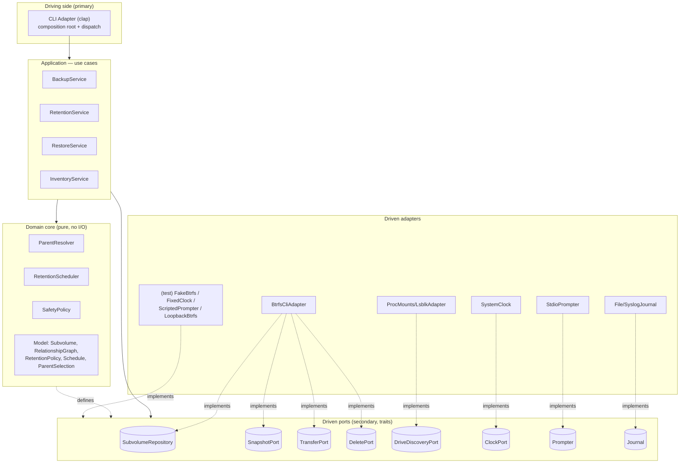
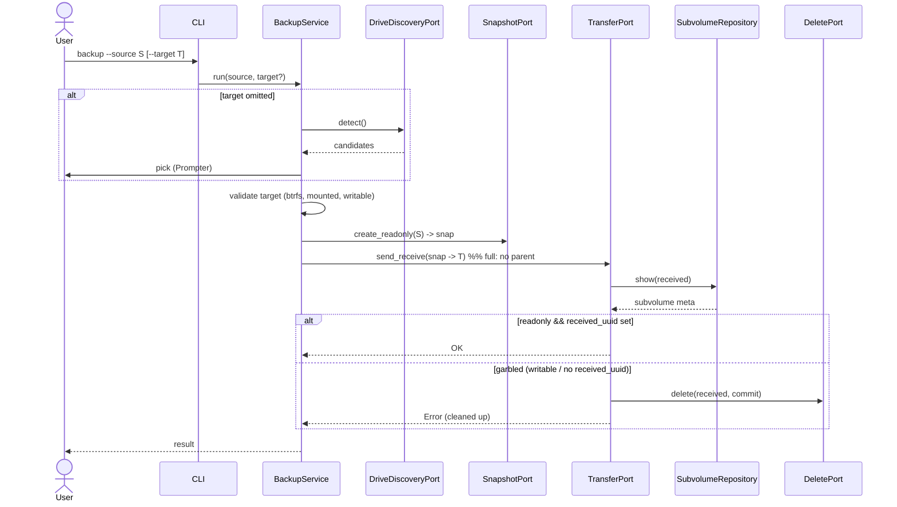
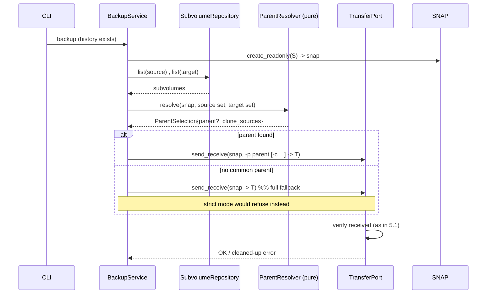
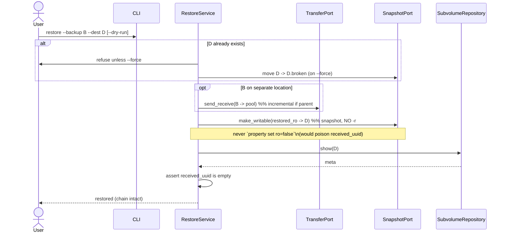

# mybtrfs — Architecture

> High-level module architecture using **SOLID** principles and **hexagonal
> (ports & adapters)** architecture, with sequence diagrams and a fail-safe
> verification pass. Companion to `01-phases-design.md` (functional per-phase
> design). **No code** — design only. Diagrams are Mermaid.

---

## 1. Guiding principles

The value and the risk of mybtrfs live in its **decisions**: which subvolume is
the right incremental parent, which snapshots to delete, how to restore without
breaking the chain. Those decisions must be **pure, deterministic, and testable
without a real filesystem**. Everything that touches the outside world — the
`btrfs` CLI, the OS mount table, the wall clock, the terminal — is a replaceable
detail.

Hexagonal architecture enforces exactly this split:

- A **domain core** with no I/O and no knowledge of `btrfs` or the OS.
- **Ports** (interfaces) describing what the core needs from / offers to the
  outside.
- **Adapters** implementing those ports against real (or fake) infrastructure.
- **The dependency rule:** all source-code dependencies point **inward**. The
  domain never imports an adapter.

---

## 2. The hexagon



Dependencies point inward: adapters depend on ports, the application depends on
ports + core, the core depends on nothing external. Concrete adapters are
selected and wired only at the **composition root** (the CLI `main`).

---

## 3. Layers in detail

### Domain core (pure, no I/O)
- **Model** — `Subvolume` (id, three UUIDs, gen/cgen, readonly, path),
  `RelationshipGraph` (the three UUID indexes), `RetentionPolicy`,
  `Schedule{preserve, delete}`, `ParentSelection{parent, clone_sources}`.
- **`ParentResolver`** — given source + target subvolume sets, produces the
  incremental parent (and clone sources) by UUID correlation, related-walk, and
  ranked strategy selection. Pure function of its inputs.
- **`RetentionScheduler`** — given timestamps + policy + reference time, returns
  `(preserve, delete)`. The hourly→daily→weekly→monthly→yearly cascade. Pure.
- **`SafetyPolicy`** — applies the non-negotiable safety rules to scheduler
  output and to restore decisions (see §5). Pure.

### Application — use cases (orchestration; depends only on ports + core)
- **`BackupService`** — Phase 1 full + Phase 2 incremental: discover/validate
  target, snapshot, resolve parent, transfer, verify, then prune via policy.
- **`RetentionService`** — Phase 3 prune: list, schedule, apply safety, delete.
- **`RestoreService`** — Phase 4: optional transfer-back, make writable, verify.
- **`InventoryService`** — list / stats / list-drives (read-only).

### Driven ports (secondary)
| Port | Responsibility |
|------|----------------|
| `SubvolumeRepository` | query `show` / `list` → model objects |
| `SnapshotPort` | create read-only snapshot; create **writable** working snapshot |
| `TransferPort` | send/receive **and** verify the received subvolume |
| `DeletePort` | delete a subvolume (with commit option) |
| `DriveDiscoveryPort` | enumerate mounted btrfs filesystems + removable hints |
| `ClockPort` | current time (injected ⇒ deterministic scheduling/naming) |
| `Prompter` | interactive drive selection / destructive-action confirmation |
| `Journal` | append-only transaction log (audit) |

Ports are kept **small and focused** (ISP): a consumer that only reads
subvolumes depends on `SubvolumeRepository`, not on a giant btrfs interface.

### Adapters
- **Driving:** `CliAdapter` parses commands and is the composition root.
- **Driven (prod):** `BtrfsCliAdapter` (shells out to `btrfs`),
  `ProcMounts/LsblkAdapter`, `SystemClock`, `StdioPrompter`, `File/SyslogJournal`.
- **Driven (test):** `FakeBtrfs` (in-memory subvolume graph), `FixedClock`,
  `ScriptedPrompter`, and a real `LoopbackBtrfs` adapter for integration tests.

---

## 4. SOLID mapping

- **SRP** — CLI parsing, btrfs invocation, scheduling logic, and orchestration
  each change for a distinct reason and live in distinct modules. The scheduler
  changes when retention semantics change; the btrfs adapter changes when the CLI
  changes; neither drags the other.
- **OCP** — new target types (raw, remote/ssh) and new parent-selection
  strategies are added as **new adapters / strategy objects**, not by editing the
  core. The hexagon is open for extension at its edges, closed for modification at
  its center.
- **LSP** — every `TransferPort` / `SubvolumeRepository` implementation (cli,
  fake, loopback) is fully substitutable; orchestrators are written against the
  port contract and never special-case an implementation.
- **ISP** — many small ports instead of one "Btrfs god-interface." `InventoryService`
  needs only `SubvolumeRepository` + `DriveDiscoveryPort`; it isn't forced to
  depend on `DeletePort`.
- **DIP** — high-level policy (orchestrators, domain) depends on **abstractions**
  (port traits); low-level details (adapters) depend on those same abstractions.
  Wiring happens once, at the composition root.

---

## 5. Sequence diagrams

### 5.1 Full backup (Phase 1)



### 5.2 Incremental backup (Phase 2)



### 5.3 Prune / retention (Phase 3)

```mermaid
sequenceDiagram
    participant CLI
    participant RS as RetentionService
    participant REPO as SubvolumeRepository
    participant SCH as RetentionScheduler (pure)
    participant SP as SafetyPolicy (pure)
    participant DEL as DeletePort

    CLI->>RS: prune [--dry-run]
    RS->>REPO: list(snapshots, backups)
    REPO-->>RS: subvolumes (+ parsed timestamps)
    RS->>SCH: schedule(timestamps, policy, now)
    SCH-->>RS: {preserve, delete}
    RS->>SP: apply_anchors(schedule, graph, target_state)
    Note over SP: force-keep newest;\nforce-keep latest common pair;\nskip all deletion if a target aborted
    SP-->>RS: safe delete-set
    alt dry-run
        RS->>CLI: print would-delete
    else
        loop each victim
            RS->>DEL: delete(subvol, commit?)
        end
    end
```

### 5.4 Safe restore (Phase 4)



---

## 6. Fail-safe & robustness verification

Each safety property and **where it is enforced** so it cannot be bypassed:

| # | Property | Enforced in | Why it holds |
|---|----------|-------------|--------------|
| 1 | A transfer is never trusted by exit code alone | `TransferPort` contract (verify is part of the operation, not the caller's job) | Every adapter must `show` the received subvolume and confirm `readonly` + `received_uuid`. |
| 2 | Interrupted/garbled backups are removed | `TransferPort` (verify step) | A writable, received-uuid-less result is detected and deleted; it can never be picked as a future parent. |
| 3 | The newest snapshot/backup is never deleted | `SafetyPolicy` (domain) | Applied to scheduler output before any `DeletePort` call. |
| 4 | The latest common snapshot/backup pair is never deleted | `SafetyPolicy` (domain) | Guarantees the next incremental run finds a parent on both ends. |
| 5 | No source snapshot pruned if a target was unreachable/aborted | `SafetyPolicy` + orchestrator abort flag | A missing destination can't cause loss of the only resumable copy. |
| 6 | A preserved backup's parent is never deleted | `SafetyPolicy` (dependency closure) | Prevents orphaning the incremental chain. |
| 7 | Restore cannot poison `received_uuid` | Port surface design | There is **no** port op to flip read-only via property; the only path to writable is `SnapshotPort.make_writable`. Unreachable-by-construction, not by discipline. |
| 8 | Dry-run never mutates state | Orchestrators short-circuit `DeletePort`/`TransferPort` writes | Previews are guaranteed side-effect-free. |
| 9 | Re-runs are non-destructive | `naming` + statelessness | Timestamped names + collision counter; truth re-derived from the filesystem each run (no drifting side DB). |
| 10 | UUID uniqueness assumption is validated | `RelationshipGraph` construction | Duplicate UUIDs (e.g. cloned disks) are rejected rather than silently mishandled. |
| 11 | Scheduling/parent logic is deterministic & testable | Pure core + injected `ClockPort` | Unit-tested with zero I/O via `FakeBtrfs` + `FixedClock`; the same code paths run in production. |
| 12 | Partial failure degrades safely | Typed error taxonomy + orchestrators | One target aborting preserves everything and reports a partial-abort exit code, rather than corrupting the chain. |

**Key structural insight:** the dangerous operations (delete, make-writable,
transfer) are reachable only through narrow ports whose contracts *embed* the
safety checks. The domain decides *what* is safe to delete/restore; the adapters
decide *how*. Neither side can skip the other's guarantees, so the fail-safe
properties are architectural, not merely conventions.

---

## 7. Why this holds up over time

- Adding **remote/ssh** or **raw/encrypted** targets = new `TransferPort` /
  `DeletePort` adapters; the orchestrators and safety logic are untouched (OCP).
- Adding a **config-file** front end = a second driving adapter beside the CLI;
  the use cases don't change.
- Swapping the `btrfs` CLI for libbtrfsutil bindings = one new driven adapter.
- The riskiest logic (retention, parent resolution, safety) stays pure and
  exhaustively unit-tested, independent of any of the above.
